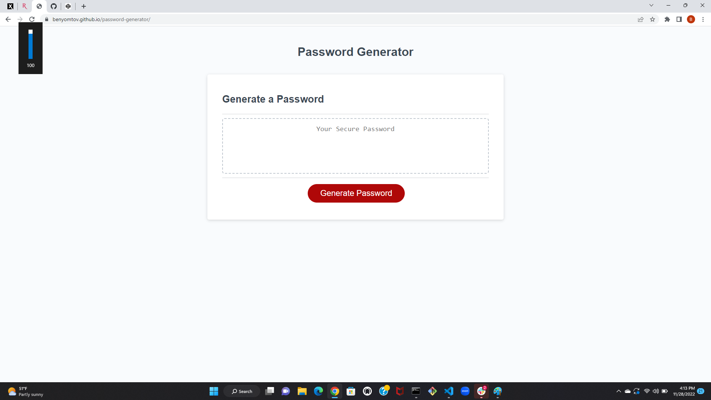
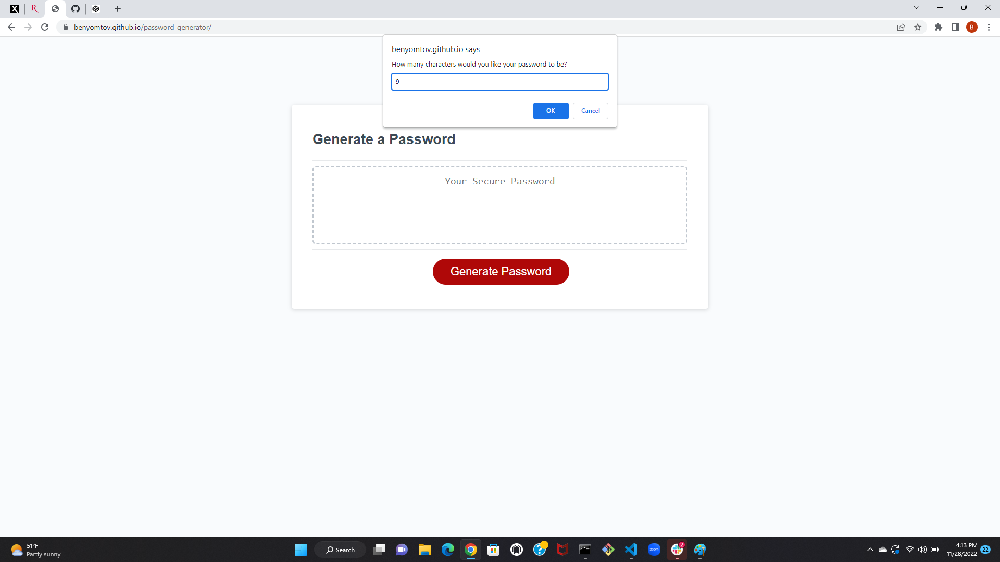
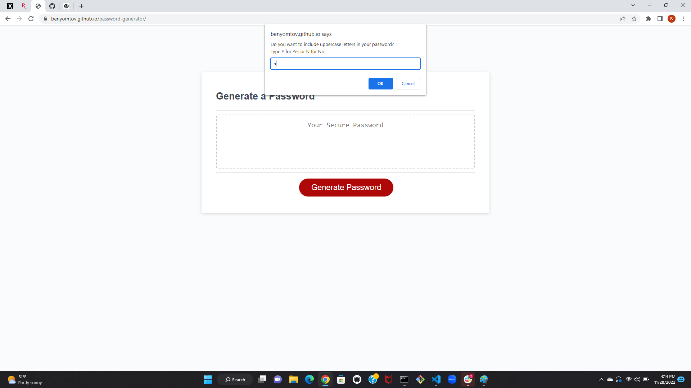
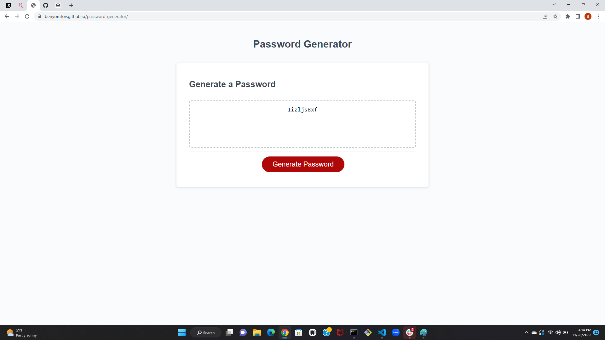

# Password Generator

## Description

This application is a password generator that collects information from the user about how long they want their password to be and what characters they want to include, using that information to generate a custom password for the user. It helps users to quickly come up with secure passwords that meet the requirements of the web application they are making the password for. 

## Installation

This web application can be accessed on any web browser at https://benyomtov.github.io/password-generator/.

## Usage

Upon entering the page, the user will notice a large red button that says "Generate Password". If the user clicks that button, a series of prompts will ask the user about how they want their custom password. The first prompt asks the user how long they would like their password to be, giving the user an option of selecting a password length of 8 characters to 128 characters. The next four prompts ask the user if they would like to include different types of characters, including lowercase, uppercase, numbers, and special characters. The user can either respond with Y for Yes and N for No. Lowercase letters work as well. If the user gives a response that does not fit the parameters of the question, like choosing 7 for the number of characters, the user will be prompted to give a permissible answer and be brought back to the question they were on. At any point, if the user wishes to cancel, they can do so by clicking the Cancel button on each prompt. After selecting a password length and at least one character type, the password will generate and appear in the text area above the 'Generate Password' button.

## Credits

Created by Ben Yomtov

## License

No license.
